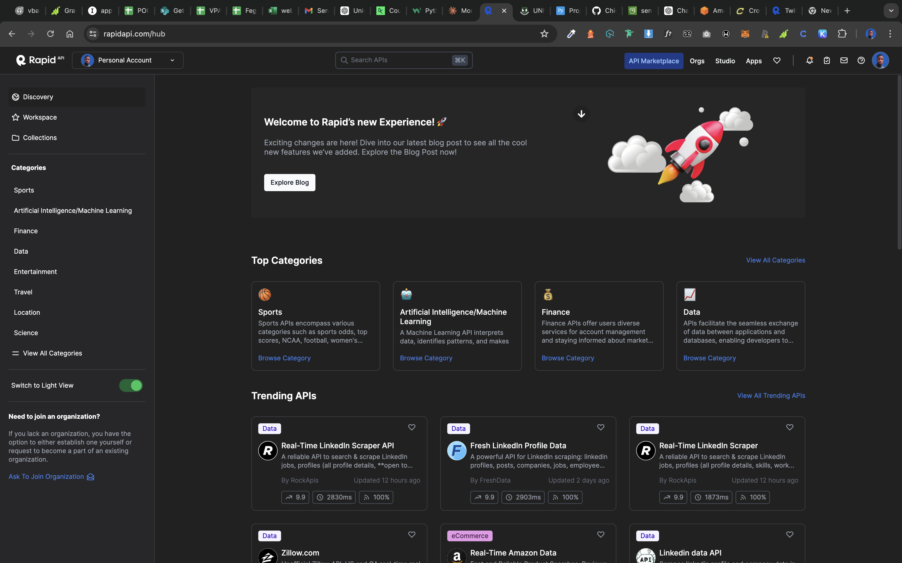
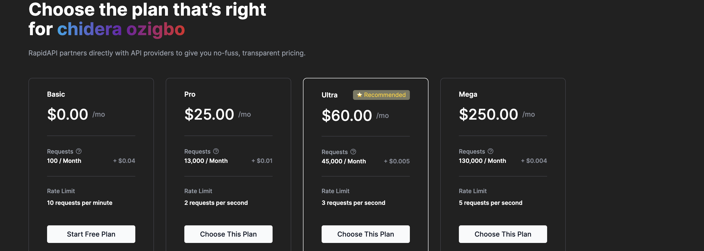

# Sentiment Analysis Pipeline

## Table of Contents
1. [Project Overview](#project-overview)
2. [Selected Brand: PiggyVest](#selected-brand-piggvest)
3. [Objectives](#objectives)
4. [Contributors](#contributors)
5. [Team Members Task](#team-members-task)
6. [Project Timeline](#project-timeline)
7. [Why Choosing Piggyvest](#why-piggyvest-was-chosen)
   - [Proposed Brand](#proposed-brands)
8. [System Architecture](#system-architecture)
9. [Technology Stack](#technology-stack)
10. [Dependencies](#dependencies)
11. [File Structure](#file-structure)
12. [Dataset Breakdown](#dataset-breakdown)
13. [Important Links](#important-links)
14. [ETL Scripts Details](#etl-script-details)
15. [GitHub Actions](#github-actions)
16. [Setup Instructions](#setup-instructions)
17. [IAM Configuration](#iam-configuration-guide)

## Project Overview
This project aims to perform sentiment analysis on Twitter data to provide insights into public sentiment towards a specific brand. The pipeline involves extracting data from the Twitter API, transforming the raw data into structured formats, and loading the processed data into an AWS S3 bucket. Snowpipe listens for new files in the S3 bucket and loads them into a Snowflake data warehouse for further analysis. The orchestration of this pipeline is managed using GitHub Actions due to cost considerations and ease of use.

## Selected Brand: Piggvest
### Why Piggvest?
Piggvest is a prominent financial technology company renowned for its innovative savings and investment solutions. The choice of Piggvest was driven by its substantial social media presence and the increasing public interest in its services. By analyzing sentiment around Piggvest, we aim to gain valuable insights into public perception and identify areas for improvement.


## Objectives
- **Sentiment Analysis:** To gauge public sentiment towards Piggvest based on Twitter data.
- **Data Insights:** To provide actionable insights that can help improve Piggvest's services.
- **Automation:** To automate the data extraction, transformation, and loading (ETL) process.

## Contributors
- **Data Engineer:** [Ozigbo Chidera](https://github.com/Chideraozigbo)
- **Data Scientist:** [Onuba Winner](https://github.com/ChibuikeOnuba)
- **Data Analyst:** [Daniel Honor](https://github.com/Hon-Nour)

## Team Members Task

### Data Engineer
- **Name:** Ozigbo Chidera
- **Tasks:**
  - Designed and implemented the ETL pipeline to extract, transform, and load data from the Twitter API to AWS S3 and Snowflake.
  - Configured and managed the AWS infrastructure, including S3 buckets, IAM roles, and policies.
  - Developed and maintained the ETL scripts, ensuring efficient and reliable data processing.
  - Implemented logging and monitoring solutions to track the ETL process and troubleshoot issues.
  - Set up GitHub Actions workflows for automated ETL runs and notifications.

### Data Analyst
- **Name:** Honor Daniel
- **Tasks:**
  - Analyzed the extracted tweet data to identify trends and insights related to Piggvest.
  - Created visualizations and dashboards to present the findings to stakeholders.
  - Conducted data validation and cleaning to ensure the accuracy and quality of the data.
  - Worked closely with the data scientist to provide data for model training and evaluation.
  - Prepared detailed reports summarizing the analysis results and recommendations.

### Data Scientist
- **Name:** Onuba Winner
- **Tasks:**
  - Developed sentiment analysis models to assess public sentiment towards Piggvest.
  - Trained and evaluated machine learning models using the cleaned tweet data.
  - Fine-tuned the models to improve accuracy and performance.
  - Integrated the sentiment analysis models into the ETL pipeline for automated scoring of new tweets.
  - Collaborated with the data analyst to interpret model results and derive actionable insights.

## Project Timeline

Our project is divided into several phases, with tasks distributed among team members based on their roles. Here's a breakdown of our timeline:

### Week 1-2: Project Setup and Infrastructure
- **Chidera Ozigbo (Data Engineer)**: 
  - Set up GitHub repository
  - Design and implement system architecture
  - Configure AWS S3 bucket
  - Set up Snowflake data warehouse
  - Implement Twitter API connection
  - Set up GitHub Actions for automated runs

### Week 3-4: Data Extraction and Processing
- **Chidera Ozigbo (Data Engineer)**: 
  - Develop data extraction script
  - Implement error handling and logging
  - Create data cleaning and transformation pipeline
  - Develop data validation checks
  - Implement Snowpipe for data ingestion
  - Optimize ETL pipeline for performance

### Week 5-6: Data Analysis and Visualization
- **Honor Daniel (Data Analyst)**: 
  - Conduct exploratory data analysis
  - Develop SQL queries for initial insights
  - Design dashboard layout
  - Implement dashboard using chosen visualization tool
  - Create visualization scripts
- **Onuba Winner (Data Scientist)**: 
  - Implement sentiment analysis using TextBlob
  - Develop advanced SQL queries for trend analysis
  - Implement anomaly detection algorithms
  - Conduct in-depth statistical analysis

### Week 7-8: Final Integration, Documentation, and Presentation
- **Chidera Ozigbo (Data Engineer)**: 
  - Integrate all components of the pipeline
  - Conduct end-to-end testing
  - Implement security measures and access controls
  - Prepare deployment documentation
- **Honor Daniel (Data Analyst)**: 
  - Finalize dashboard with real-time data updates
  - Prepare final presentation of insights
  - Create user guide for dashboard
- **Onuba Winner (Data Scientist)**: 
  - Develop predictive models based on sentiment data on Piggvest
  - Conduct performance evaluation of models
  - Prepare technical documentation of analysis and models

## Why Piggyvest Was Chosen

Piggyvest was selected as the brand for this project due to several compelling reasons:

1. **Market Presence:** Piggyvest has a significant presence in the financial technology sector, making it a relevant and impactful brand to analyze.
2. **Customer Interaction:** The brand actively engages with its customers on social media, providing ample data for sentiment analysis and trend identification.
3. **Growth Potential:** As a growing fintech company, understanding public sentiment and customer feedback is crucial for Piggyvest's strategic decisions and growth.
4. **Diverse Data:** Piggyvest's interactions on platforms like Twitter provide diverse and rich data, ideal for developing robust sentiment analysis models.
5. **Innovative Solutions:** Piggyvest is known for its innovative savings and investment solutions, making it an interesting subject for analyzing customer sentiment and feedback.


### Proposed Brands

Here are the lists of brands that was considered before we chose Piggvest.

1. Cowrywise
2. MTN
3. Geepay
4. Uber
5. PiggyVest
6. Hack Sultan
7. Air Peace
8. Moniepoint
9.  Indrive
10. Chowdeck


## System Architecture

Data Flow:
1.	Data Extraction: Tweets are extracted from the Twitter API using a Python script.
2.	Data Storage: The raw tweet data is stored as JSON files in the `data/raw/` directory.
3.	Data Transformation: The raw data is transformed into structured CSV files, which are saved in the `data/processed/` directory.
4.	Data Loading: The raw and processed data files are uploaded to an AWS S3 bucket.
5.	Data Ingestion: Snowpipe listens to the S3 bucket for new files and loads them into a Snowflake data warehouse.
6.	Orchestration: GitHub Actions are used to automate the ETL process, running the script weekly on Tuesdays and sends email anytime a team member pushes a code to the repo.

### Architecture Diagram:


## Technology Stack

GitHub Actions
- Reason for Use: GitHub Actions is chosen over Apache Airflow for cost-effectiveness and ease of integration with GitHub repositories. Airflow requires a live server to run, which can incur additional costs.
- Usage: Automates the ETL process, running the script weekly and notifies the team on code pushes.

Twitter API
- Reason for Use: Provides access to real-time tweet data.
- Usage: Extracts tweets related to the brand of interest.

AWS S3
- Reason for Use: Provides scalable storage for raw and processed data.
- Usage: Stores raw JSON data and processed CSV files.

Snowflake
- Reason for Use: A cloud data warehouse optimized for analytics.
- Usage: Stores and analyzes the processed data ingested from S3 via Snowpipe.

## Dependencies

This project relies on several Python libraries and modules to perform various tasks, including configuration management, data requests, data processing, and natural language processing (NLP). Below is a detailed breakdown of each dependency:

- **Configparser**
  - Purpose: Used for handling configuration files. It allows the script to read configuration settings from `secrets.ini` file, which includes API keys and AWS credentials.
  - Usage: Reading API keys and credentials securely from a configuration file.

- **Requests**
  - Purpose: Enables the script to send HTTP requests. It's essential for interacting with APIs, such as the Twitter API.
  - Usage: Fetching data from external APIs.

- **Pandas**
  - Purpose: A powerful data manipulation and analysis library. It provides data structures like DataFrames.
  - Usage: Processing and transforming the extracted data into a structured format for analysis.

- **JSON**
  - Purpose: Provides methods for parsing JSON formatted data.
  - Usage: Handling JSON responses from APIs.

- **Datetime**
  - Purpose: Supplies classes for manipulating dates and times.
  - Usage: Managing timestamps for logging and data processing.

- **Hashlib**
  - Purpose: Implements secure hash algorithms.
  - Usage: Creating unique hashes for tweets to avoid processing duplicates.

- **Re (Regular Expressions)**
  - Purpose: Provides support for regular expressions.
  - Usage: Cleaning and preprocessing text data.

- **Emoji**
  - Purpose: Allows the handling of emojis in text.
  - Usage: Detecting and removing or interpreting emojis in tweets.

- **Textblob**
  - Purpose: A simple NLP library built on NLTK and Pattern.
  - Usage: Lemmatization and text processing.

- **NLTK (Natural Language Toolkit)**
  - Purpose: A comprehensive library for NLP.
  - Usage: Tokenizing text and removing stopwords.

- **Boto3**
  - Purpose: The Amazon Web Services (AWS) SDK for Python. It enables Python developers to create, configure, and manage AWS services.
  - Usage: Interacting with AWS services like S3.

- **OS**
  - Purpose: Provides a way of using operating system dependent functionality.
  - Usage: Handling file paths and environment variables.

- **Botocore Exceptions**
  - Purpose: Provides a base exception class for Boto3.
  - Usage: Handling exceptions when interacting with AWS services.

- **Time**
  - Purpose: Provides various time-related functions.
  - Usage: Managing delays and handling timing for requests.

- **Requests Exceptions**
  - Purpose: Provides exception handling for Requests library.
  - Usage: Handling exceptions when sending HTTP requests.


## File Structure

```bash
File Structure
├── .github
│   └── workflows
│       ├── daily_etl.yaml
│       └── push-notification.yaml
├── config
│   └── secrets.ini
├── data
│   ├── raw
│   └── processed
│       ├── users
│       └── users_tweet
├── docs
│   ├── images
│   └── analysis.md
├── logs
│   ├── etl_log.txt
│   ├── last_run.txt
│   └── processed_tweet_hashes.txt
├── models
│   └── trained_model.pkl
├── notebooks
│   └── analysis_notebook.ipynb
├── scripts
│   ├── etl
│   │   └── etl.py
│   └── model
│       └── web_app.py
├── .gitignore
├── README.md
└── requirements.txt
```
### File and Directory Descriptions
- `.github/workflows/`
  - `daily_etl.yaml`: GitHub Action to run the ETL pipeline weekly.
  - `push-notification.yaml`: GitHub Action to send an email to team members whenever any member of the team pushes to the repo.
- `config/secrets.ini`: Holds API keys and AWS credentials.
- `data/raw/`: Stores raw JSON data extracted from the Twitter API.
- `data/processed/`: Stores processed CSV files.
  - `users/`: Stores user details in CSV format.
  - `users_tweet/`: Stores tweet details in CSV format.
- `docs/`: Documentation files.
  - `images/`: Holds images for documentation.
  - `analysis.md`: Document detailing the data analysis process.
- `logs/`: Log files for monitoring the ETL process.
  - `etl_log.txt`: Logs of ETL pipeline execution.
  - `last_run.txt`: Timestamp of the last successful run.
  - `processed_tweet_hashes.txt`: Hashes of processed tweets to avoid duplication.
- `models/`: Stores trained model files.
  -	`trained_model.pkl`: Pickle file of the trained model.
- `notebooks/`: Jupyter notebooks for analysis.
  -	`analysis_notebook.ipynb`: Notebook used for data analysis.
- `scripts/`: Python scripts for ETL and model deployment.
  -	`etl/`: Directory for ETL scripts.
    - `etl.py`: Main script for the ETL pipeline.
  - `model/`: Directory for model deployment scripts.
    - `web_app.py`: Script to build the model web application.
- `.gitignore`: Specifies files and directories to be ignored by Git.
  - `config/secrets.ini`: Avoids committing sensitive information.
  - `.DS_Store`: MacOS system file.
  - `data/.DS_Store`
  - `docs/.DS_Store`
  - `scripts/.DS_Store`
- `README.md`: Project documentation and instructions.
- `requirements.txt`: Lists the dependencies required for the project.

  ## Dataset Breakdown

  ## User Table

| Column             | Data Type | Constraints              | Description                      |
|--------------------|-----------|--------------------------|----------------------------------|
| display_name       | TEXT      | NOT NULL                 | User's display name              |
| username           | TEXT      | NOT NULL                 | User's actual name               |
| user_description   | TEXT      | NULL                     | Description of the user          |
| user_id            | INTEGER      | PRIMARY KEY, NOT NULL    | Unique identifier for the user   |
| followers_count    | INTEGER   | NOT NULL                 | Number of followers              |
| favourites_count   | INTEGER   | NOT NULL                 | Number of favorites              |
| avatar             | TEXT      | NULL                     | URL of the user's avatar         |
| is_verified        | BOOLEAN   | NOT NULL                 | Whether the user is verified     |
| following_count    | INTEGER   | NOT NULL                 | Number of users being followed   |

## Tweet Table

| Column         | Data Type | Constraints              | Description                                |
|----------------|-----------|--------------------------|--------------------------------------------|
| tweet_id       | INTEGER      | PRIMARY KEY, NOT NULL    | Unique identifier for the tweet            |
| user_id        | INTEGER      | FOREIGN KEY, NOT NULL    | ID of the user who posted the tweet        |
| created_at     | TIMESTAMP | NOT NULL                 | Timestamp when the tweet was created       |
| text           | TEXT      | NOT NULL                 | Cleaned text of the tweet                  |
| url            | TEXT      | NULL                     | URL present in the tweet                   |
| mentions       | TEXT      | NULL                     | User mentions in the tweet                 |
| lang           | TEXT      | NOT NULL                 | Language of the tweet                      |
| favorites      | INTEGER   | NOT NULL                 | Number of favorites the tweet received     |
| retweets       | INTEGER   | NOT NULL                 | Number of retweets                         |
| replies        | INTEGER   | NOT NULL                 | Number of replies                          |
| quotes         | INTEGER   | NOT NULL                 | Number of quotes                           |
| views          | INTEGER   | NOT NULL                 | Number of views                            |
| hashtags       | TEXT      | NULL                     | Hashtags used in the tweet                 |

## Relationship and Constraints

- **user_id**: A primary key in the user table, ensuring each user is unique.
- **tweet_id**: A primary key in the tweet table, ensuring each tweet is unique.
- **Foreign Key**: The user_id in the tweet table references the user_id in the user table, establishing a relationship between users and their tweets.

### Explanation

- **One-to-Many Relationship**: The relationship between the user table and the tweet table is a one-to-many relationship. This means that one user (identified by user_id) can have multiple tweets (each identified by tweet_id). This relationship allows us to link each tweet to the user who posted it, making it possible to analyze and aggregate tweets by individual users.


## Important Links

- [Analysis Documentation](docs/analysis.md)
- [ETL Script](scripts/etl/etl.py)
- [GitHub Actions Workflow](.github/workflows/)
- [Model Folder](scripts/model/)
- [Notebooks](notebook)
- [Raw Data](data/raw)
- [Processed Data](data/processed)

## ETL Script Details

### Extraction

The `extract_api` function connects to the Twitter API, fetches tweets, and saves them as raw JSON files. It handles pagination and deduplication by checking for processed tweet hashes. The function logs each step, including successful connections and data saving.

### Steps Performed During Extraction

1. **Starting the Extraction Phase:**
    - Logging the start of the extraction phase.
    - Setting up the API headers with the required API key and host.

2. **Initializing Query Parameters and Data Structures:**
    - Defining the query parameters to search for tweets related to "piggyvest".
    - Initializing an empty list to store all fetched tweet data.
    - Initializing `next_cursor` to handle pagination.
    - Loading previously processed tweet hashes to avoid duplicate processing.

3. **Handling Pagination and API Requests:**
    - Entering a loop to handle pagination and fetch all pages of data.
    - Updating query parameters with the cursor ID if available and logging the cursor ID.

4. **Retry Logic for API Requests:**
    - Implementing a retry loop to handle potential API request failures.
    - Logging the attempt number and waiting before retrying if an error occurs.
    - Breaking out of the retry loop upon a successful API connection or logging failure after maximum retries.

5. **Processing API Response:**
    - Parsing the JSON response from the API.
    - Initializing a set to store new tweet hashes for deduplication.

6. **Deduplicating Tweets:**
    - Looping through each tweet in the API response.
    - Generating a hash for each tweet based on its ID and content.
    - Checking if the tweet hash has already been processed.
    - Adding unique tweets to the data list and marking duplicate tweets in the logs.

7. **Handling Pagination Continuation:**
    - Checking for the presence of a `next_cursor` in the API response to continue fetching the next page.
    - Logging the absence of further pages and breaking the loop when no more data is available.

8. **Saving Raw Data:**
    - Logging the start of the raw data saving process.
    - Writing all fetched tweet data to a JSON file in the specified format.
    - Logging the successful saving of raw data.

9. **Saving Processed Tweet Hashes:**
    - Saving the hashes of newly processed tweets to a file to avoid reprocessing in future runs.
    - Logging the completion of the extraction phase.

10. **Returning Data and File Path:**
    - Returning the fetched tweet data and the path to the saved raw data file.


### Transformation

The `transform` function converts raw tweet data into structured CSV files. It extracts user details and tweet information, cleans the text, removes duplicates, and saves the data into CSV files. The function logs each transformation step and ensures the data is ready for loading.

### Transformations Performed

1. **Initializing Logging and Patterns:**
    - Logging the start of the transformation phase.
    - Compiling a regex pattern to extract URLs .

2. **Extracting User and Tweet Details:**
    - Initializing empty lists for user details and tweets.
    - Looping through each tweet in the input data to extract user details and tweet information.

3. **Extracting and Cleaning User Information:**
    - Extracting user details such as `display_name`, `username`, `user_description`, `user_id`, `followers_count`, `favourites_count`, `avatar`, `is_verified`, and `following_count`.
    - Appending the extracted user information to the `user_details` list.

4. **Extracting and Cleaning Tweet Information:**
    - Extracting hashtags and converting them to a single string.
    - Extracting URLs from tweet text using the compiled regex pattern.
    - Cleaning the tweet text by:
        - Removing mentions (e.g., `@username`) and URLs.
        - Removing extra spaces.
        - Removing non-alphanumeric characters except periods, commas, and apostrophes.
        - Converting emojis to their text descriptions.
    - Finding all mentions in the original tweet text.
    - Logging the number of tweets transformed.

5. **Appending Cleaned Tweet Information:**
    - Extracting tweet details such as `tweet_id`, `user_id`, `created_at`, `text`, `url`, `mentions`, `lang`, `favorites`, `retweets`, `replies`, `quotes`, `views`, and `hashtags`.
    - Appending the cleaned tweet information to the `tweets` list.

6. **Converting Lists to DataFrames:**
    - Converting the `user_details` and `tweets` lists to DataFrames.
    - Logging the successful conversion of lists to DataFrames.

7. **Removing Duplicate User IDs:**
    - Logging the initial count of users.
    - Dropping duplicate user IDs from the `df_users` DataFrame.
    - Logging the final count of users and the number of duplicate user IDs dropped.

8. **Removing Empty or NaN Text Rows in Tweets:**
    - Logging the initial count of tweets.
    - Dropping rows with empty or NaN text in the `df_users_tweet` DataFrame.
    - Logging the final count of tweets and the number of tweets dropped due to empty or NaN text.

9. **Saving DataFrames to CSV Files:**
    - Logging the start of the CSV saving process.
    - Saving the `df_users` and `df_users_tweet` DataFrames to CSV files.
    - Logging the successful saving of CSV files and the end of the transformation phase.

10. **Returning CSV File Paths:**
    - Returning the paths to the saved users and tweets CSV files.

### Loading

The `load_to_s3` function uploads files to an AWS S3 bucket. It takes the file path, bucket name, and object name as arguments and logs the upload process. The function ensures data is available in S3 for Snowpipe to ingest into Snowflake.

### Steps Performed During Load

1. **Starting the Load Phase:**
    - Logging the start of the load phase for the specified file path.

2. **Setting the S3 Object Name:**
    - If the `object_name` is not provided, setting it to the basename of the file path.

3. **Creating an S3 Client:**
    - Creating an S3 client using the provided AWS access key ID and secret access key.

4. **Uploading the File:**
    - Attempting to upload the file to the specified S3 bucket and object name.
    - Logging a success message if the file is uploaded successfully.
    - Returning `True` to indicate a successful upload.

5. **Handling Upload Errors:**
    - Catching any `ClientError` exceptions that occur during the upload process.
    - Logging an error message if the upload fails.
    - Returning `False` to indicate a failed upload.

### Main Function
The `main` function orchestrates the ETL process by calling the extraction, transformation, and loading functions sequentially. It logs the start and completion of the ETL pipeline.

### Steps Performed in the ETL Pipeline

1. **Starting the ETL Pipeline:**
    - Logging the start of the ETL pipeline.

2. **Extraction Phase:**
    - Calling the `extract_api` function to extract raw tweet data.
    - Receiving the raw data and the path to the saved raw data file.

3. **Transformation Phase:**
    - Calling the `transform` function to transform the extracted raw data into structured CSV files.
    - Receiving the paths to the saved users and tweets CSV files.

4. **Loading Phase:**
    - Uploading the raw data file to the S3 bucket by calling `load_to_s3`.
    - Uploading the users CSV file to the S3 bucket by calling `load_to_s3`.
    - Uploading the tweets CSV file to the S3 bucket by calling `load_to_s3`.

5. **Completing the ETL Pipeline:**
    - Logging the completion of the ETL pipeline.

## GitHub Actions
### Weekly ETL Workflow
This workflow runs every Thursday at noon UTC and can also be triggered manually. It performs the following steps:
1. **Checkout repository:** Checks out the code from the repository.
2. **Set up Python:** Sets up Python 3.11.5.
3. **Install dependencies:** Installs required Python packages.
4. **Download NLTK data:** Downloads necessary NLTK data files.
5. **Ensure logs directory exists:** Creates a directory for logs if it doesn't exist.
6. **Add secrets.ini file:** Adds API keys and AWS credentials to `config/secrets.ini`.
7. **Run ETL script:** Executes the ETL script.
8. **Collect metadata:** Collects metadata about the run.
9. **Update last run file:** Updates the `logs/last_run.txt` file with the latest run information.
10. **Commit and push updated files:** Commits and pushes the updated logs to the repository.
11. **Success notification:** Sends a success notification email if the job succeeds.
12. **Failure alert:** Sends a failure alert email if the job fails.

### Push Notification Workflow
This workflow triggers on every push to any branch and performs the following steps:
1. **Checkout code:** Checks out the code from the repository.
2. **Get push details:** Collects details about the push event.
3. **Send email:** Sends an email notification with the push details to the team members.

## Setup Instructions

## Prerequisites
- Python 3.9 or later
- Git
- Rapid API account
- A GitHub account

## Step-by-Step Setup

### 1. Subscribe to RapidAPI

#### Step 1: Visit RapidAPI
- Go to [RapidAPI](https://rapidapi.com).



#### Step 2: Create an Account or Log In
- If you do not have an account, sign up using your email or log in using your existing credentials.

#### Step 3: Subscribe to the API
- Go to this link to use the particular twitter I used [here](#https://rapidapi.com/alexanderxbx/api/twitter-api45/playground/apiendpoint_62f1afb3-7621-423d-87c6-104da27b5c37).
- Click on the link and navigate to the top right corner of your screen. You should see `subscribe to test`


- Select the appropriate subscription plan and subscribe.




#### Step 4: Get API Credentials
- Once subscribed, go to the "Endpoints" tab of the API.
- Locate the `x-rapidapi-host` and `x-rapidapi-key` under the "Code Snippets" section.

### 2. Clone the Repository

#### Step 1: Clone the Repository
First, clone the repository to your local machine using Git:
```bash
git clone https://github.com/ChibuikeOnuba/Sentiment-Analysis-Project.git
cd Sentiment-Analysis-Project
```

### 3. Create a Virtual Environment

#### Step 1: Create and Activate Virtual Environment

It's a good practice to create a virtual environment to manage your dependencies:

``` bash
python3 -m venv venv
source venv/bin/activate  
```

### 4. Install Dependencies
 
#### Step 1: Install Required Python Packages

Install the required Python packages using pip 

``` bash
pip install -r requirements.txt
```
### 5. Create secrets.ini File

#### Step 1: Create `config` Directory

If the `config` directory does not already exist, create it:

```bash
mkdir config
```

#### Step 2: Create secrets.ini File

Create a secrets.ini file in the config directory to store your API keys and AWS credentials. This file should not be pushed to GitHub.

config/secrets.ini:

```bash
[API_KEY]
x_rapidapi_key = YOUR_X_RAPIDAPI_KEY
x_rapidapi_host = YOUR_X_RAPIDAPI_HOST

[AWS_CREDENTIALS]
ACCESS_KEY_ID = YOUR_AWS_ACCESS_KEY_ID
SECRET_ACCESS_KEY = YOUR_AWS_SECRET_ACCESS_KEY

[EMAIL]
email_user = YOUR_EMAIL_USER
email_password = YOUR_EMAIL_PASSWORD(Not your regular gmail password)
```
### 6. Modify `etl.py` File

#### Step 1: Update Bucket Name and Paths
In the `etl.py` file, update the bucket name and any other necessary configurations to match your setup. Replace any placeholder values with your actual bucket name and paths.

### 7. Configure Git to Ignore `secrets.ini`
#### Step 1: Update .gitignore

Ensure that your `secrets.ini` file is not tracked by Git by adding it to your `.gitignore` file:

```bash
config/secrets.ini
```
### 8. Setup GitHub Secrets
#### Step 1: Add GitHub Secrets

Before pushing to GitHub, add your credentials as secrets to your GitHub repository:

  - Go to your GitHub repository.
  - Navigate to "Settings" > "Secrets and variables" > "Actions".
  - Click on "New repository secret" and add the following secrets with their values:
   - `X_RAPIDAPI_KEY`
   - `X_RAPIDAPI_HOST`
   - `AWS_ACCESS_KEY_ID`
   - `AWS_SECRET_ACCESS_KEY`
   - `EMAIL_USER`
   - `EMAIL_PASS`

### 9. Push to GitHub
#### Step 1: Commit and Push Code

Make sure you have committed all your changes and pushed the code to GitHub:
```bash
git add .
git commit -m "Initial commit"
git push origin main
```
### 10. Automating with GitHub Actions
#### Step 1: GitHub Actions Workflows

The project includes GitHub Actions workflows to automate the ETL process. Ensure that your GitHub repository is set up with the necessary secrets as described above.


## IAM Configuration Guide

Here are the steps I took for create my IAM Configuration

### Step 1: Create the IAM User Group
1. **Sign in to the [AWS Management Console](https://console.aws.amazon.com/console/home?nc2=h_ct&src=header-signin).**
2. **Open the IAM console** by searching for "IAM" in the Services menu.
3. In the left navigation pane, choose **"User groups."**
4. Choose **"Create group."**
5. In the **"Group name"** field, enter `DataTeam`.
6. Skip the step to attach policies for now and choose **"Create group."**

### Step 2: Create the IAM Policy for Read-Only Access to the S3 Bucket
1. In the IAM console, in the left navigation pane, choose **"Policies."**
2. Choose **"Create policy."**
3. Select the **"JSON"** tab and paste the following policy document:

    ```json
    {
        "Version": "2012-10-17",
        "Statement": [
            {
                "Effect": "Allow",
                "Action": [
                    "s3:GetObject",
                    "s3:ListBucket"
                ],
                "Resource": [
                    "arn:aws:s3:::sentimentanalysisprojectpipeline",
                    "arn:aws:s3:::sentimentanalysisprojectpipeline/*"
                ]
            }
        ]
    }
    ```
4. Choose **"Next: Tags"** (you can skip adding tags).
5. Choose **"Next: Review."**
6. In the **"Name"** field, enter `S3ReadOnlySentimentAnalysis`.
7. Review the policy and choose **"Create policy."**

### Step 3: Attach the Policy to the User Group
1. In the IAM console, in the left navigation pane, choose **"User groups."**
2. Choose the `DataTeam` group you created.
3. In the **"Permissions"** tab, choose **"Add permissions."**
4. Choose **"Attach policies directly."**
5. Search for the `S3ReadOnlySentimentAnalysis` policy you created.
6. Select the policy and choose **"Next: Review."**
7. Choose **"Add permissions."**

### Step 4: Create the IAM Users
1. In the IAM console, in the left navigation pane, choose **"Users."**
2. Choose **"Add user."**
3. In the **"User name"** field, enter `DataScientist`.
4. Select the **"AWS Management Console access"** checkbox.
5. Choose **"Custom password"** and enter a password (ensure to store it securely).
6. Choose **"Next: Permissions."**
7. On the **"Set permissions"** page, choose **"Add user to group."**
8. Select the `DataTeam` group.
9. Choose **"Next: Tags"** (you can skip adding tags).
10. Choose **"Next: Review."**
11. Choose **"Create user."**
12. Repeat these steps to create the `DataAnalyst` user.

### Step 5: Add the Users to the Group
1. In the IAM console, in the left navigation pane, choose **"Users."**
2. Choose the `DataScientist` user.
3. In the **"User groups"** tab, choose **"Add user to groups."**
4. Select the `DataTeam` group.
5. Choose **"Add to group."**


